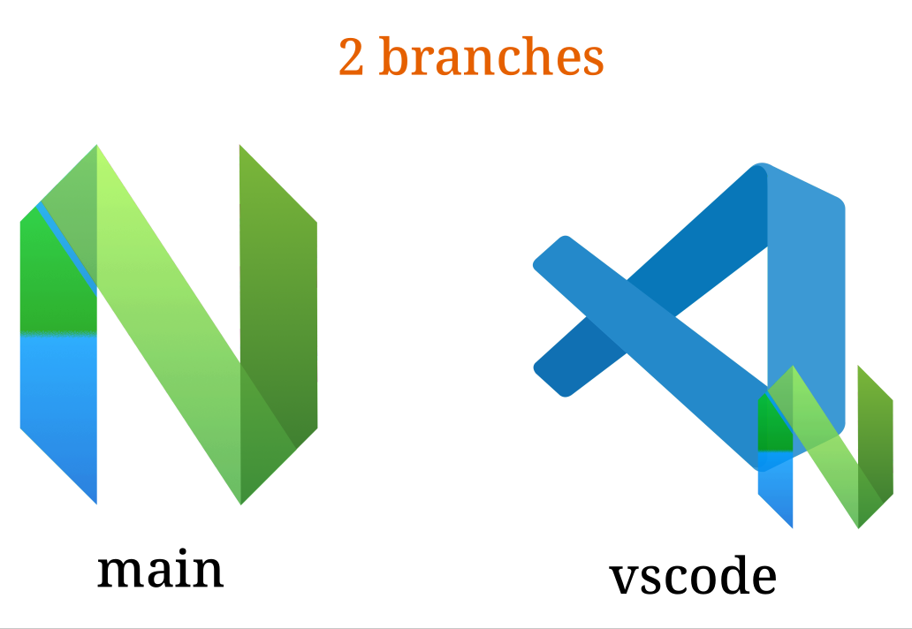

<p align="center">
  
</p>

# NeoVim config for bonkers

I quickly got tired of big maintained projects such as AstroNvim, mostly because I use only 30% of what they offer

At the same time I wanted to start from scratch, so I avoided any presets like lazy.nvim starter or kickstart.nvim,
though there is nothing unusual

I'm not trying to turn NeoVim into all-in-one IDE for one specific reason, VSCodium (a.k.a. VSCode)
has excellent support with NeoVim instance via [vscode-neovim extension](https://github.com/vscode-neovim/vscode-neovim).



For this reason, there are 2 branches of this config (besides the legacy one):

- `main`: used for neovim-only instance
- `vscode`: used in pair with VSCodium, for this reason all UI features of neovim were cut there

## Installation

For neovim-only instance:

```shell
$ cd ~/.config/
$ mv nvim nvim.bak # Save current config, if it exists
$ git clone -b main https://github.com/ButterSus/nvim-dotfiles nvim
```

For vscode-neovim instance:

```shell
$ cd ~/.config/
$ git clone -b vscode https://github.com/ButterSus/nvim-dotfiles nvim-vscode
$ cd nvim-vscode
$ bash sync.sh # This will launch vscode config installer
```

If you want both, I'd recommend using git worktrees:

```shell
$ cd ~/.config/
$ git clone -b main https://github.com/ButterSus/nvim-dotfiles nvim
$ cd nvim
$ git worktree add ../nvim-vscode vscode
$ cd ../nvim-vscode
$ bash sync.sh # This will launch vscode config installer
```

## Configuration

Look for file `lua/local_settings.example.lua`, copy it as `lua/local_settings.lua`, and add your customization

If you want more, just add new plugin entry by following [Lazy guidelines](https://lazy.folke.io/spec) in `lua/plugins/`
